# Detector
使用PyTorch实现了经典的深度学习检测算法：
* [OverFeat](#overfeat)(2013.12)
* [R-CNN](#r-cnn)(2013.11)
* [SPP-net](#spp-net)(2014.6)
* [Fast R-CNN](#fast)(2015.4)
* [Faster R-CNN](#faster)(2015.6)
* [FCN](#fcn)(2014.11)
* [R-FCN](#r-fcn)(2016.5)
* [FPN](#fpn)(2016.12)
* [Mask R-CNN](#mask)(2017.3)
* [Mask^X R-CNN](#maskx)(2017.11)
* [DetectorNet](#detectornet)(2013)
* [DenseBox](#densebox)(2015.9)
* [MTCNN](#mtcnn)(2016.4)
* [FaceBoxes](#faceboxes)(2017.8)
* [YOLO](#yolo)(2015.6)
* [YOLOv2](#yolov2)(2016.12)
* [YOLOv3](#yolov3)(2018.3)
* [SSD](#ssd)(2015.12)
* [DSSD](#dssd)(2017.1)
* [FSSD](#fssd)(2017.12)
* [ESSD](#essd)(2018.1)
* [RFBNet](#rfbnet)(2017.11)
* [DeformableConvNets](#deformableconvnets)(2017.3)
* [DSOD](#dsod)(2017.8)
* [**RetinaNet**](#retinanet)(2017.8)
* [Light-Head R-CNN](#light-head)(2017.11)

------
## Requisites:
* anaconda
* pytorch-0.3.0
* torchvision
* visdom

------
## 经典的传统目标检测算法
* Haar + AdaBoost
    * 参考论文1：Rapid Object Detection using a Boosted Cascade of Simple Features,
    Viola & Jones, 2001
    * 参考论文2：Robust Real-Time Face Detection, Viola & Jones, 2002
    * 参考论文3：Informed Haar-Like Features Improve Pedestrian Detection,
    ShanShan Zhang等, 2014
* LBP + AdaBoost
    * 参考论文1：Multiresolution gray-scale and rotation invariant 
    texture classification with local binary patterns, Ojala等, 2002
    * 参考论文2：Learning Multi-scale Block Local Binary Patterns for Face Recognition,
    Shengcai Liao, 2007
    * 参考论文3：局部二值模式方法研究与展望, 宋克臣, 2013
* HOG + SVM(Cascade)
    * 参考论文1：Histograms of Oriented Gradients for Human Detection,
    Dalal & Triggs, 2005
    * 参考论文2：Fast Human Detection Using a Cascade of Histograms of Oriented 
    Gradients, Qiang Zhu等, 2006
* ACF + AdaBoost
    * 参考论文1：Integral Channel Features, Piotr Dollar等, 2009
    * 参考论文2：Fast Feature Pyramids for Object Detection, Piotr Dollar等, 2014
    * 参考论文3：Local Decorrelation For Improved Detection, Piotr Dollar等, 2014
* DPM
    * 参考论文1：A Discriminatively Trained, Multiscale, Deformable Part Model,
    Pedro等， 2008
    * 参考论文2：Object Detection with Discriminatively Trained Part Based Models,
    Pedro & ross等, 2010
    * 参考论文3：Visual Object Detection with Deformable Part Models, Pedro & ross等,
    2013
    * 参考论文4：Deformable Part Models are Convolutoinal Neural Networks,
    ross等, 2015  
本工程主要实现基于深度学习的检测算法，对传统算法感兴趣的同学可以阅读上面列出的论文，或相关博客。

[返回顶部](#detector)

------
## 前排膜拜大牛
* Ross Girshick(rbg): [个人主页](http://www.rossgirshick.info/), 主要成就：
    * DPM
    * R-CNN
    * Fast R-CNN
    * Faster R-CNN
    * YOLO
* Kaiming He(何恺明): [个人主页](http://kaiminghe.com/), 主要成就：
    * 2003年广东省理科高考状元
    * 图像去雾
    * ResNet
    * MSRA 初始化
    * Group 正则化
    * PReLU
    * SPPNet
    * Faster R-CNN
    * Mask R-CNN
    * Mask^X R-CNN
    * 炉石传说

[返回顶部](#detector)

------
## OverFeat
[OverFeat](https://arxiv.org/abs/1312.6229)
通过一个卷积网络来同时进行分类，定位和检测三个计算机视觉任务。

### 基础知识
* 卷积网络在小数据集上作用不明显
* 卷积网络最大的优点是不用人工设计特征;最大的缺点是需要大量标注的数据。

### offset max-pooling

* Pooling时每次的起点不一样，Pooling后得到了3\*3\*C个特征图
* 该操作可以作为最后一层Pooling的方法，移除了Poolig操作本应该带来的分辨率损失

### FCN in test

* 在测试时将全连接层替换成1\*1的卷积层
* 允许测试时输入不同大小的图像，等价与传统的滑动窗口方法，滑动步长取决于Pooling的次数。

### 主要创新点
* offset pooling
* 测试时将全连接层替换成1\*1的卷积层
* 测试时使用不同大小图像作为的输出(Multi-Scale)
* 卷积层参数共享: 固定卷积层的参数，将分类层替换层回归层，用于定位和检测。

[返回顶部](#detector)

------
## R-CNN
[R-CNN](https://arxiv.org/abs/1311.2524)
第一次将CNN应用到目标检测上，在目标检测领域取得了巨大突破。

### Object detection system overview

* 候选区域(Region proposals)：使用传统的区域提取方法，
通过滑动不同宽高的窗口获得了2K个潜在的候选区域。
* 使用CNN提取特征：将每个候选区域‘reSize’到固定大小，最终获得了4096维的特征。
* 使用SVM进行分类：每类训练一个SVM进行分类。注，作者测试使用softmax时mAP下降了3.3。
* 位置精修(Bounding-box regression, 边框回归)：提升了3-4mAP.

### 主要创新点
* 将CNN应用于目标检测
* 训练数据稀缺时，可以先从其他大的数据集进行预训练，然后在小数据集上进行微调(fine-tune)

[返回顶部](#detector)

------
## SPP-net
[SPP-net](https://arxiv.org/abs/1406.4729)
利用空间金字塔池化，使得任意大小的特征图都能够转换成固定大小的特征向量。
从而解决了CNN的输入必须是固定尺寸的问题，实现了多尺度输入。
因此SPP-net只需对原图做一次卷积，节省了大量的计算时间，比[R-CNN](#r-cnn)有24～102倍的提速。  
另外，SPP对分类性能也有帮助，获得了2014年imageNet挑战中检测的第二名和分类的第三名。
另外两个是VGG和GoogLeNet，
相关内容请参考[Classifier](https://github.com/mandeer/Classifier)工程。

### SPPNet structure

* 使用卷积网络提取特征：每幅图只做一次卷积，而不是每个候选区域做一次卷积运算。
* 将候选区域映射到最后一层的feature map上，然后使用SPP得到固定长度的特征。
* 使用SVM进行分类：同[R-CNN](#r-cnn)
* 边框回归：同[R-CNN](#r-cnn)

### 主要创新点
* 空间金字塔池化(spatial pyramid pooling, SPP)：对每个bins使用全局最大值池化，
得到的特征仅于bins和feature map的个数有关，与feature map的尺寸无关。
从而解决了CNN的输入必须是固定尺寸的问题，实现了多尺度输入。
* 多尺度输入的模型训练与测试方法：不同尺度输入的模型间参数共享。

[返回顶部](#detector)

------
## Fast
[Fast R-CNN](https://arxiv.org/abs/1504.08083)
把类别判断和边框回归统一到了一个深度网络框架中，首次实现了end-to-end(proposal阶段除外)的训练。

### Fast R-CNN architecture

* 输入：整图及一系列候选区域
* 使用卷积网络提取特征
* RoI Pooling：为每个候选区域提取固定长度的特征。
* 分类、边框回归

### 主要创新点
* RoI pooling：仅有一层的[SPP](#spp-net)层，多尺度学习能提高一点点mAP，却成倍增加了计算量。
* Fine-tuning方法--分层采样：解决了[R-CNN](#r-cnn)和[SPP-net](#spp-net)训练低效的问题。
* Multi-task loss：Lcls & Lloc共享参数，mAP有约1%的提升。
* Smooth_L1 Loss：比L1 loss更鲁棒，比L2 loss对离群点更不敏感。

[返回顶部](#detector)

------
## Faster
[Faster R-CNN](https://arxiv.org/abs/1506.01497)
提出了RPN(Region Proposal Network), 终于将目标检测的四个基本步骤,
生成候选区域、特征提取、分类、边框回归统一到一个深度网络框架之中。  
Faster R-CNN的代码主要参考了
[这里](https://github.com/chenyuntc/simple-faster-rcnn-pytorch)

### Faster R-CNN architecture

* 输入：整图
* 通过RPN网络得到proposal boxes
* 使用NMS(非最大值抑制)降低冗余
* 检测class得分比较高的候选区域

### 主要创新点
* Region Proposal Networks: 因为与Fast R-CNN共享特征，所以RPN几乎不消耗计算资源。
又因为RPN可以提高候选区域的质量，故提高了检出率。
* 候选区域、锚点(Anchors): 多尺度锚点解决了待检测目标拥有不同尺度和宽高比例的问题。
* RPN和Fast R-CNN共享特征的训练方法：
    * 从预训练模型W0开始，训练RPN，得到W1
    * 使用W1得到的候选区域及于训练模型W0，训练Fast R-CNN，得到W2
    * 使用W2，训练RPN，但固定前面的共享层，仅微调RPN独有的网络层，得到W3
    * 使用W3，训练Fast R-CNN，同样固定前面的共享层，仅训练Fast R-CNN独有的层，得到最终的W4
    * 重复上述过程得到的改进不大。

[返回顶部](#detector)

------
## FCN
[FCN](https://arxiv.org/abs/1605.06211)
提出了一种end-to-end、pixels-to-pixels的语义分割(Semantic Segmentation)方法，
是将CNN结构应用到图像语义分割领域并取得突出结果的开山之作，
因而拿到了CVPR 2015年的best paper honorable mention.

### FCN architecture
  
* 使用语义分割的ground truth作为监督信息，训练了一个端到端、点到点的网络。

### 卷积化(convolutionalization)
  
* 将全连接层替换成卷积层，因此FCN可以接受任意尺寸的输入图像从而进行密集预测。

### 跳跃结构(skip layers)
  
* 使用反卷积(转置卷积)和跳跃结构，融合深层粗略的全局信息和浅层精细的局部信息。
* 全局信息解决的“是什么”，而局部信息解决的是“在哪里”

### 主要创新点
* 卷积化
* 使用反卷积进行上采样
* 使用跳跃结构融合深层和浅层的特征

[返回顶部](#detector)

------
## R-FCN
[R-FCN](https://arxiv.org/abs/1605.06409)
使用位置敏感得分图(position-sensitive score maps),
解决了图像分类(平移不变性)和物体检测(平移变换性)两者间的矛盾，
从而解决了[Faster R-CNN](#faster)中部分卷积层无法共享计算的问题。

### R-FCN architecture

* 在ROI层之后，没有可学习的层，从而加快了训练和测试的速度

### position-sensitive RoI pooling

### 主要创新点
* 位置敏感得分图
    * 使用1\*1的卷积得到K^2(C+1)维的位置敏感得分图
    * 位置敏感的ROI Pooling：具体的pooling细节参考上图
    * 投票(vote, 均值)得到C+1维的向量
    * softmax or bbox regression(4K^2)

[返回顶部](#detector)

------
## FPN
[FPN](https://arxiv.org/abs/1612.03144)
提出了一种简单的在卷积网络内部构建特征金字塔的框架，即使卷积网络对目标的尺度变化有很强的鲁棒性，
特征金字塔仍然可以显著的改进原始网络的性能。

### FPN architecture

* Bottom-up pathway: 骨干网络，以卷积和降采样的方式提取特征
* Top-down pathway: 上采样深层粗粒度特征，提高深层特征的分辨率
* lateral connections: 融合浅层特征和深层特征

### 主要创新点
* 特征金字塔：低层的特征语义信息比较少，但是目标位置准确；
高层的特征语义信息比较丰富，但是目标位置比较粗略。
二者联合得到了在不同分辨率都拥有丰富语义特征的特征金字塔。

[返回顶部](#detector)

------
## Mask
[Mask R-CNN](https://arxiv.org/abs/1703.06870)
通过在[Faster R-CNN](#faster)基础上添加了一个用于预测目标掩模的新分支(mask branch)，
在没有增加太多计算量，且没有使用各种trick的前提下，在COCO的一系列挑战任务
(instance segmentation, object detection & person keypoint detection)中
**都**取得了领先的结果。  
作者开源了caffe2的[Mask R-CNN代码](https://github.com/facebookresearch/Detectron)

### 什么是实例分割

### Mask R-CNN 框架

* 在Faster R-CNN的第二级上添加了与class和bbox并行的mask分支。
* multi-task loss: L = Lcls + Lbox + Lmask

### ROIAlign

* 对feature map进行线性插值后再使用Pooling，
ROIPooling的量化操作(rounding)会使mask与实际物体位置有一个微小的偏移(8 pixel)

### 主要创新点
* mask分支：mask任务对分类和检测性能有帮助。
* [ROIAlign](#roialign): ROI校准，解决了mask的偏移问题。同时对检测性能也有提升。
* Lmask: 逐像素 sigmoid 的平均值，每类单独产生一个mask，依靠class分支获取类别标签。
将掩模预测和分类预测拆解，没有引入类间竞争，从而大幅提高了性能。

[返回顶部](#detector)

------
## MaskX
[Learning to Segment Every Thing](https://arxiv.org/abs/1711.10370)
是指使用只有部分类别标注了mask label(但所有类别都标注了bbox label)的数据，
训练出可以分割所有类别(包括没有mask标注的类)的模型。
利用迁移学习的思想，通过在[Mask R-CNN](#mask)的原架构上添加了一个
权重传递函数(weight transfer function)实现了这一目标。

### 分割示例

* 图中绿框表示有mask标注的类，红框表示只有bbox标注的类
* 可以很方便的从mask转换成bbox。反过来呢，提取的BBox特征是否对mask也有帮助？

### Mask^X R-CNN method

* 设A类有mask和bbox的标注，B类仅有bbox的标注
* 使用A和B共同训练标准的目标检测(注意，A和B的训练需要是同质的)
* 仅使用A训练mask和权重传递函数
* 在推理时，权重传递函数用于预测每个类别的实例分割参数，
从而使模型能够分割所有目标的类别。

### 主要创新点
* 开创了了一个令人兴奋的新的大规模实例分割的研究方向。
* 权重传递函数：链接了bbox和mask，将box head的特征迁移到mask head中，
这样对于缺乏mask ground-truth的类别，只要有box ground-truth，依然可以进行有效分割。
* 结合MLP和FCN：FCN更多的关注于细节，而MLP可以提取全局(主要)特征。

[返回顶部](#detector)

------
## DetectorNet
[DetectorNet](http://papers.nips.cc/paper/5207-deep-neural-networks-for-object-detection.pdf)
将目标检测看做是一个回归问题，证明了基于DNN的目标掩码回归也可以捕捉到强烈的几何信息。

### DetectorNet框架

* 输出是full, left, right, top, bottom共5个mask, 其中后四个是半框, 图1仅显示了其中3个。
* scale1: multi-scale + 滑动窗口(子窗口)
* scale2: 精细化调整, bboxs放大1.2倍后，再跑一遍

### 主要创新点
* 目标函数添加正则化约束: 解决正负标签不均衡问题。
* 5个Mask: full, left, right, top, bottom
    * 解决目标重叠问题
* multi-scale + 精细化调整(refinement): 
    * 解决由于mask比较小, 无法精确定位的问题。

[返回顶部](#detector)

------
## DenseBox
[DenseBox](https://arxiv.org/abs/1509.04874)
使用全卷积网络实现了end-to-end的目标检测。

### DenseBox 架构

* 输入: m\*n\*c的图像, 输出: m/4 \* n/4 \* 5的feature map;
(5维分别表示与4条边的距离, 以及置信度)
* 全卷积, 常规卷积网络之后执行上采样
* 测试时使用图像金字塔输入

### 主要创新点
* end-to-end的FCN实现目标检测
* 仅使用包含目标(背景足够)的图像块进行训练(240的图像块，人脸占中间的50个像素)
* ５通道输出, 每个像素都表示了一个对象
* 多尺度特征融合
* 样本均衡
* 关键点检测任务有助于检测性能的提升

[返回顶部](#detector)

------
## MTCNN
[MTCNN](https://arxiv.org/abs/1604.02878v1)
使用级联的CNN, 实现了实时(CPU)的人脸检测的人脸关键点的回归。

### MTCNN 级联架构

* 图像金字塔输入
* PNet(Proposal, FCN, 滑动窗口): 浅层CNN, 快速生成候选窗口
* RNet(Refine): 略复杂的CNN, 快速过滤候选窗口
* ONet(Output): 强大的CNN, 输出bbox和关键点

###　主要创新点
* 实时的人脸检测及关键点回归方案
* 关键点检测有助于人脸检测的性能
* Multi-source training
* Online Hard sample mining

[返回顶部](#detector)

------
## FaceBoxes
[FaceBoxes](https://arxiv.org/abs/1708.05234)
是另一种可以在CPU上做到实时的人脸检测算法, 且该算法的运行速度与人脸个数无关。

### FaceBoxes 网络结构
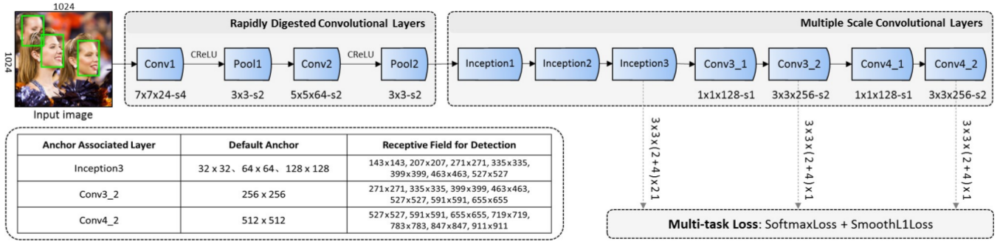
* RDCL: 快速降低feature map的大小, 以加快CNN前向运行加速
* MSCL: 通过Inception模块和multi-scale feature maps获得不同大小的感受野

### 主要创新点
* RDCL(Rapidly Digested ConvolutionalLayers):
    * Shrinking the spatial size of input: large stride sizes
    * Choosing suitable kernel size
    * Reducing the number of output channels: C.ReLU
* MSCL(Multiple Scale Convolutional Layers):
    * Multi-scale design along the dimension of network depth: 
    multi-scale feature maps
    * Multi-scale design along the dimension of network width: 
    inception module
* Anchor densification strategy:
    * 增加小人脸的采样密度

[返回顶部](#detector)

------
## YOLO
[YOLO](https://arxiv.org/abs/1506.02640)
将目标检测任务看作目标区域预测和类别预测的回归问题，
采用单个神经网络直接预测目标边界和类别概率，实现端到端的目标检测，
是第一个基于CNN的实时通用目标检测系统。 

### You Only Look Once
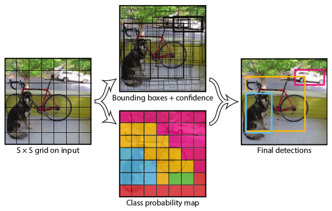
* 图像被分割成SxS个网格
* 每个网格单元预测B(=2)个边界框
* 这些预测被编码为S×S×(Bx5+C)的张量

### YOLO 损失函数
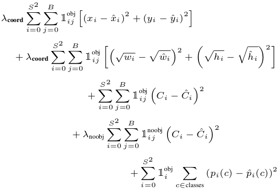
* lambda coord=5, lambda noobj=0.5: 增加了边界框坐标预测损失，减少不包含目标边界框的置信度预测损失
* 边界框宽度和高度的平方根: 大盒子小偏差的重要性不如小盒子小偏差的重要性

### 主要创新点
* end-to-end的实时通用目标检测系统: 将目标检测的流程统一为单个神经网络(one stage)
* 隐式编码了上下文信息: 假阳性概率比Fast-RCNN低，可以提升Fast-RCNN
* DackNet24网络架构
* 目标检测通常需要细粒度的视觉信息，将输入分辨率从224×224变为448×448
* 优化了平方和误差(Sum-squared error)

### 优缺点
* 优点:
    * 速度快: Fast YOLO超过150fps
    * 背景误检(假阳性)的概率比Fast-RCNN低
* 缺点:
    * 检出率相对较低，特别是(密集)小目标。
    * 容易产生定位错误

[返回顶部](#detector)

------
## YOLOv2
[YOLOv2](https://arxiv.org/abs/1612.08242)
是对[YOLO](#yolo)的改进，在保持原有速度的同时提升了精度。  
同时，作者还提出了一种目标分类与检测的联合训练方法，
同时在COCO和ImageNet数据集中进行训练得到**YOLO9000**，
实现了9000多类物体的实时检测。

### The path from YOLO to YOLOv2
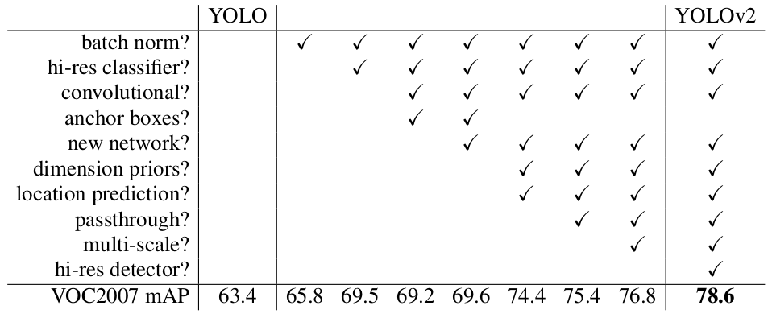

### WordTree
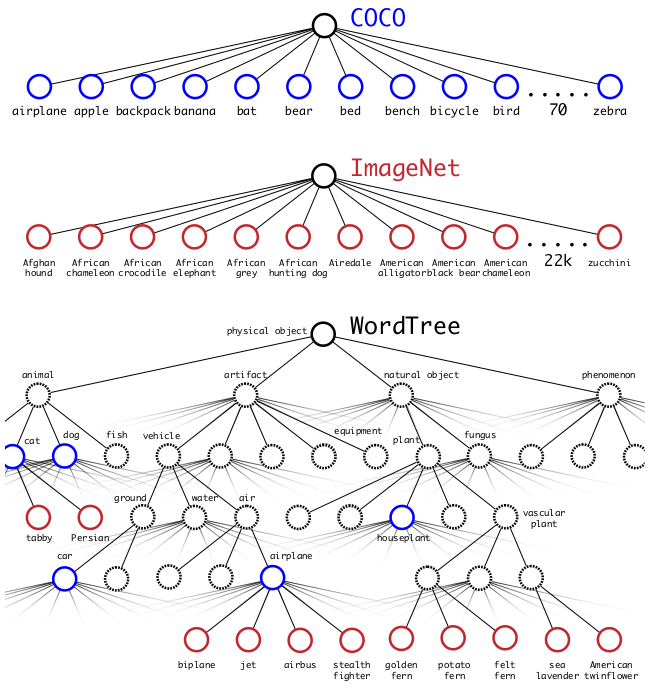
* 分层树: 在WordNet中, 大多数同义词只有一个路径,
因此首先把这条路径中的词全部都加到分层树中。
接着迭代地检查剩下的名词, 并尽可能少的把他们添加到分层树上, 
添加的原则是取最短路径加入到树中。
* 为什么没有采用多标签模型(multi-label model)??

### 主要创新点
* 对YOLO的一系列分析和改进: 参见 The path from YOLO to YOLOv2
* Darknet-19
    * 预训练(224x224)后，使用高分辨率图像（448×448）对模型进行fine-tune
    * 每个author输出125维(5\*(5+20), VOC)
* 可以根据需要调整检测准确率和检测速度
* WordTree
* 联合训练分类和检测:
    * 使用目标检测数据训练模型学习定位和检测目标; 再使用分类数据去扩展模型对多类别的识别能力。
    * 对于仅有类别信息的图像, 只会反向传播分类部分的损失
    * 使用WordTree可以把多个数据集整合在一起
    * WordTree 与 分层分类 与 multiple softmax
    * 计算某一结点的绝对概率，需要对这一结点到根节点的整条路径的所有概率进行相乘

[返回顶部](#detector)

------
## YOLOv3
[YOLOv3](https://pjreddie.com/publications/)
对[YOLO](#yolo)又做了一些更新, 使其变的更好。

### 性能对比

### Bounding boxes
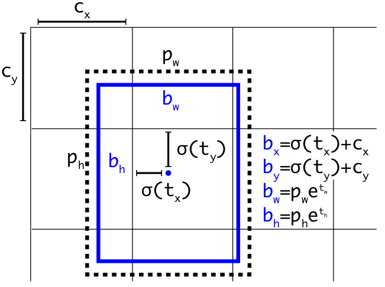

### The Deal
* Bounding Box Prediction:
    * dimension clusters as anchor boxes
    * 每个bbox通过逻辑回归预测一个是否存在目标的得分
* Class Prediction
    * using multi-label classification(binary cross-entropy loss) for each box
* Predictions Across Scales
    * 3 different scales similar to [FPN](#fpn)
    * NxNx(3x(4+1+80)) per scale with COCO
    * 使用聚类得到9个bbox priors
* Feature Extractor
    * Darknet-53

### 不足
* AP50时表现非常好, 但是, 当IOU的阈值增加时, 效果不如[RetinaNet](#retinanet)
* 大目标检测APl, 性能变差了

[返回顶部](#detector)

------
## SSD
[SSD](https://arxiv.org/abs/1512.02325)
是另一个常用的基于CNN的实时通用目标检测系统, 且其速度快过[YOLO](#yolo), 
精度与[Faster R-CNN](#faster)持平。 

### SSD framework
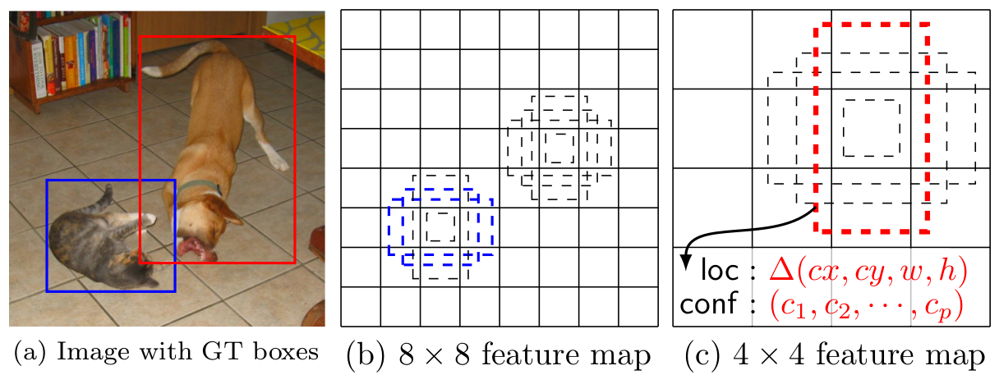
* 默认框: 
    * nulti-scale feature maps
    * each location
    * different aspect ratios
* model loss = localization loss(Smooth L1) + confidence loss(Softmax)

### SSD model
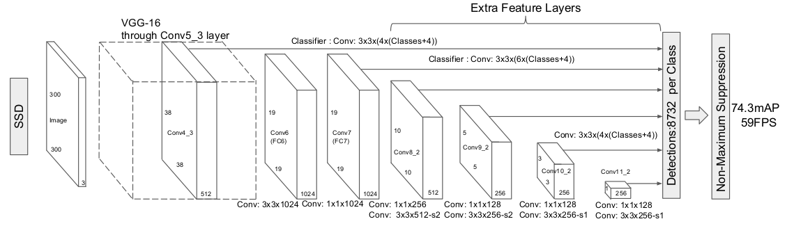
* base network + auxiliary structure
* Multi-scale feature maps for detection
* (c+4)kmn outputs for a mxn feature map

### 主要创新点
* 使用小卷积滤波器来预测特征图上固定的一组默框的类别分数和位置偏移
* 使用不同尺度的特征图和不同的宽高比来检测不同大小和形状的目标
* 速度快: 去掉了挑选候选框和之后的特征(或像素)重采样
* Convolutional predictors for detection: YOLO使用的是全连接层
* 每一个目标至少有一个默认框: 不同于MultiBox(每一个目标只有一个默认框)
* Hard negative mining: 正负样本比为1:3

### 不足
* 小目标检出率比较低
* SSD有较小的定位误差, 但是易混淆相似类别的对象

[返回顶部](#detector)

------
## DSSD
[DSSD](https://arxiv.org/abs/1701.06659)
通过使用反卷积增加了大量的上下文信息, 提高了上下文相关联目标的检出率, 
且改善了原始[SSD](#ssd)对小目标检测效果不好的问题。

### DSSD vs. SSD
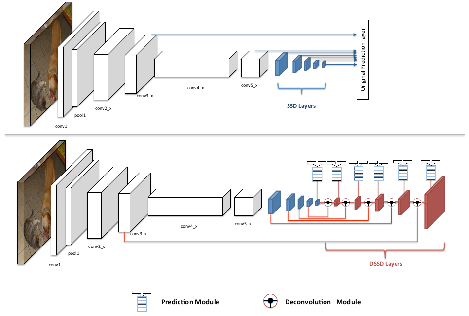
* 基准网络从 VGG 变成 Residual-101
* 添加了Prediction module 和 Deconvolutional module

### 主要创新点
* 更好的基准网络: Residual-101
* Prediction module: 改善子任务的子网络
* Deconvolution Module: 与[FPN](#fpn)的head略有不同
* 通过改写卷积层的weight和bias去除Batch Norm操作

[返回顶部](#detector)

------
## FSSD
[FSSD](https://arxiv.org/abs/1712.00960)
通过融合不同尺度的特征，在速度损失很少的情况下，大幅提升了性能。

### FSSD vs. SSD
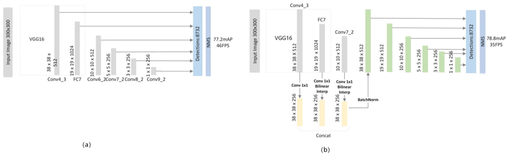
* 使用双线性插值(bilinear interpolation)进行上采样
* 使用串联(concatenation)的方式合并不同的特征图
* 使用融合后的特征图构建特征金字塔

### 主要创新点
* 新的特征融合框架: 不同与[DSSD](#dssd)和[FPN](#fpn)
* 小目标检测优于SSD
* 降低了检测出多个或部分物体(multi-part of one object)的概率

[返回顶部](#detector)

------
## ESSD
[ESSD](https://arxiv.org/abs/1801.05918)
提出了一种新的不同尺度特征融合的方法，在尽量小损失速度的前提下，提升[SSD](#ssd)的精度。

### ESSD framework
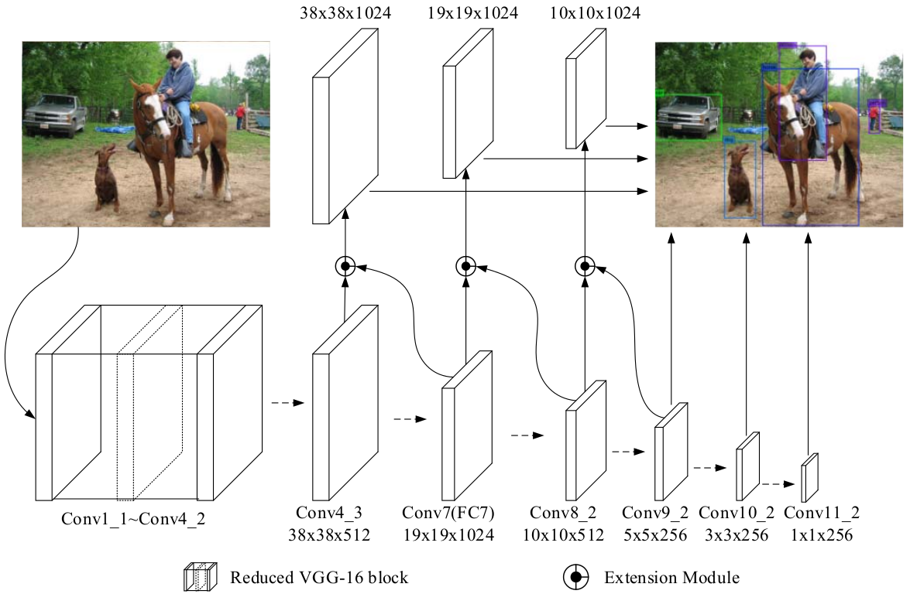
* 仅前三个预测层使用了Extension module
* Conv4_3, Conv7, Conv8_2 and Conv9_2 can receive gradient backpropagation from multiple layers
### Extension module
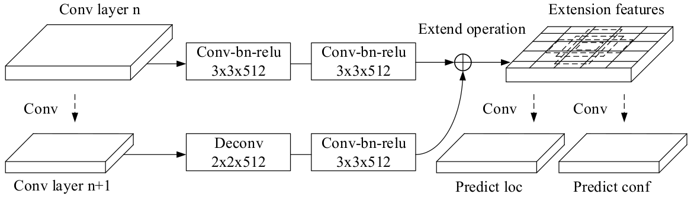

### 主要创新点
* Extension module
* 加权平均深度(Weighted average depth): 预测层的加权平均深度间的差异不应太大

[返回顶部](#detector)

------
## RFBNet
[RFBNet](https://arxiv.org/abs/1711.07767)
借鉴人类视觉的感受野结构(Receptive Fields, RFs), 提出了RF Block (RFB) module, 
然后将RFB module集成进了[SSD](#ssd)结构。
作者提供了[源码](https://github.com/ruinmessi/RFBNet)

### RFB module
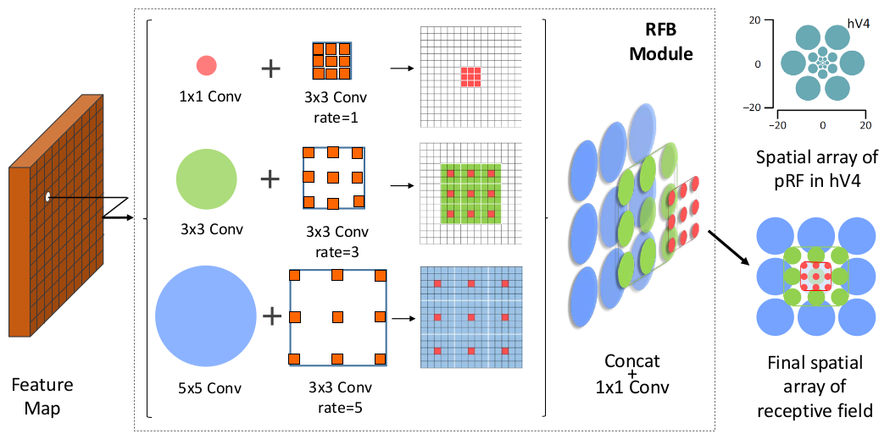
* multiple branches with different kernels
* 扩张卷积(空洞卷积)

### 主要创新点
* RFB module
* RFB Net: 嵌入了RFB模块的SSD

[返回顶部](#detector)

------
## DeformableConvNets
[Deformable ConvNets](https://arxiv.org/abs/1703.06211)
提出了可变形卷积, 大大增强了CNN的几何变换建模能力。
证明了在CNN中学习密集的空间变换是可行和有效的。

### Deformable Conv
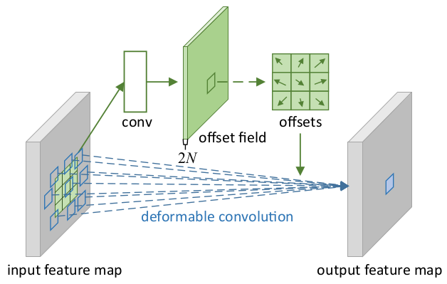
* 增加模块中的空间采样位置以及额外的偏移量，并且从目标任务中学习偏移量，且不需要额外的监督
* 可变形卷积和与普通卷积有相同的输入和输出，可以很容易地进行替换
* 可变形卷积能很容易地通过标准反向传播进行端到端的训练

### 可变形卷积的感受野
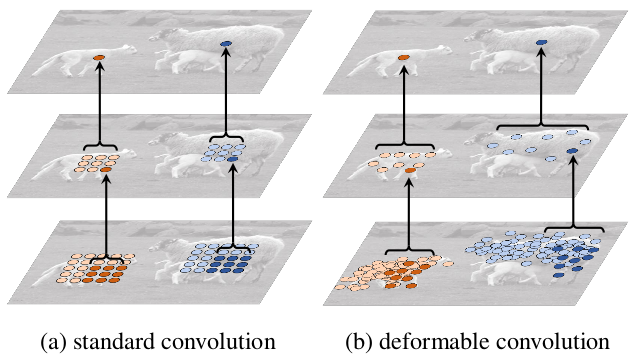
* 可变形卷积可以根据目标的尺寸和形状进行自适应调整
* 增强了对非刚性物体的表达能力

### 主要创新点
* deformable convolution
* deformable RoI pooling

[返回顶部](#detector)

------
## DSOD
[DSOD](https://arxiv.org/abs/1708.01241)
是首个从零开始学习并且获得高精度的目标检测算法。

### DSOD vs. SSD
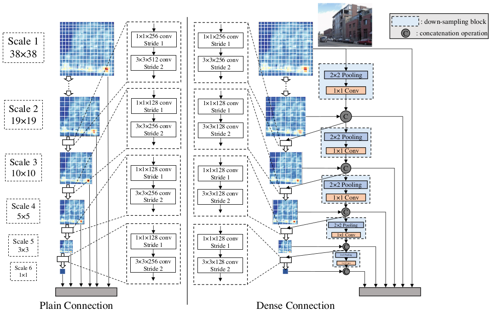
* 骨干网络(backbone sub-network): DenseNets的变体
* 前端子网(front-end sub-network): Dense Prediction Structure

### 使用预训练模型
* 优点
    * 有许多公开发布的先进模型
    * 重用已训练好的模型更方便且节省训练时间
    * 缓解目标检测任务标注数据较少的问题
* 缺点
    * 网络结构设计不够灵活
    * 学习偏差(Learning bias): 分类和检测任务之间的损失函数和类别分布都不相同
    * 域不匹配(Domain mismatch): 深度图像, 医学图像, 多光谱图像等 

### 从０开始训练目标检测器的原则
* Proposal-free: Roi Pooling阻碍了梯度的传播
* Deep Supervision: dense layer-wise connection
* Dense Prediction Structure: 
    * Learning Half and Reusing Half

[返回顶部](#detector)

------
## RetinaNet
[RetinaNet](https://arxiv.org/abs/1708.02002)
提出了Focal Loss, 降低分类清晰的样本损失的权重, 
从而解决了one-stage检测器中正负样本失衡的问题。

### Focal Loss

* 动态缩放的交叉熵损失函数: 随着正确分类置信度的增加，函数中的比例因子逐渐缩减至零
* 自动地减小简单样本的影响, 并快速地将模型的注意力集中在困难样本上
* Focal Loss函数的确切形式并不重要
* 这个曲线看起来不太好, 应该有其他比较好的函数表示？？

### RetinaNet 网络结构
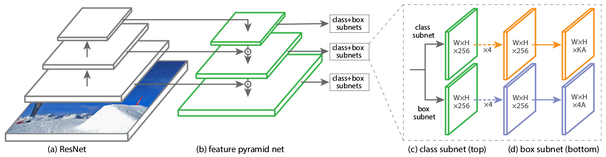
* FPN Backbone
* 使用密集的 Anchors: 9 anchors per level
* 分类子网和框回归子网共享结构, 但却使用各自的参数

### 主要创新点
* one-stage目标检测率低的很大一部分原因来自类别不平衡
* Focal Loss: 解决了one-stage目标检测的类别不平衡问题
* RetinaNet: 速度与精度

[返回顶部](#detector)

------
## Light-Head R-CNN
[Light-Head R-CNN](https://arxiv.org/abs/1711.07264)

[返回顶部](#detector)

------
更多有关目标检测的论文，请参考
[这里](https://handong1587.github.io/deep_learning/2015/10/09/object-detection.html)  
想要查看VOC2012的排行榜请点击
[这里](http://host.robots.ox.ac.uk:8080/leaderboard/displaylb.php?challengeid=11&compid=4)

  
  
