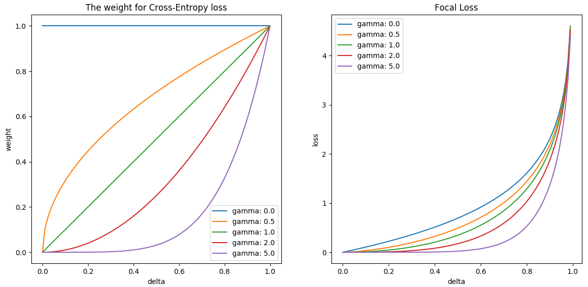

# RetinaNet-PyTorch

## 参考
* [kuangliu/pytorch-retinanet](https://github.com/kuangliu/pytorch-retinanet)  
* [Focal Loss for Dense Object Detection](https://arxiv.org/abs/1708.02002)

## 依赖
* PyTorch-0.3

### Focal Loss

* Focal Loss = weight * Cross-Entropy loss
* delta 是指预测值与真实值之间的差异
* gamma = 0 时, Focal Loss 就是 Cross-Entropy loss

### 训练初期发散
* 将iou<0.5的author的类别设为0时, 会在训练的初期就发散
* lr=0.01时, 需要将Focal Loss的alpha设为0.9999才能不发散(背景的author太多)
